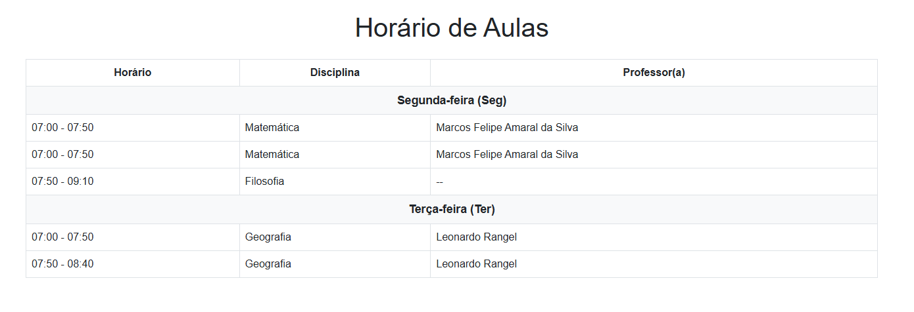

# API Backend - Gerenciamento da Grade Escolar 

Bem-vindo à API Backend para o gerenciamento da grade escolar! Este projeto foi desenvolvido para facilitar a administração de turmas, disciplinas e professores, permitindo que escolas e instituições organizem suas atividades de forma eficiente. Com esta API, você poderá gerenciar a alocação de aulas, horários e professores de maneira simples e intuitiva.

## Pré-requisitos

Antes de começar, certifique-se de que você tem o Python instalado em sua máquina. É recomendável usar a versão 3.7 ou superior.

## Exemplo visual em um FrontEnd


## Passos para Configuração

### 1. Crie um Ambiente Virtual

Crie um ambiente virtual para isolar as dependências do seu projeto:

```bash
python -m venv venv

# Ative o ambiente

# No Windows
venv\Scripts\activate
# No Linux/Mac
source venv/bin/activate

# Instale as dependências
pip install -r requirements.txt

# Instale as dependências novamente caso precisar
pip install pydantic mysql-connector-python fastapi uvicorn

# executar
python -m uvicorn main:app --reload

#docker
docker-compose up --build
